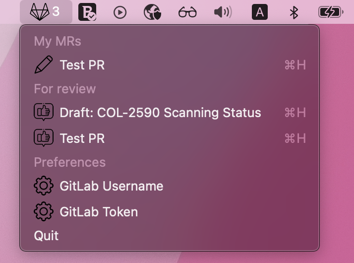

# GitLab Integration

In case you often forget about your opened MRs or MRs on which you are assigned as a reviewer this app comes to the rescue (hey all you mob/pair programming advocates look other way :zany_face: ). Purpose of the app is to present number of opened MRs in MacOS top bar and to enable quick navigation to MRs.

Look how pretty it is :heart_eyes:

App is simple and has some basic features are:
- Present total number of your MRs and MRs where you are assigned as a reviewer within top bar
- List all your MRs and enable navigation
- List all MRs on which you are assigned as a reviewer and enable navigation
- Enable setup of GitLab username and token for API access

# Setup

## Create GitLab token
For creating GitLab personal token check this [guide](https://docs.gitlab.com/ee/user/profile/personal_access_tokens.html#create-a-personal-access-token)

## Launch on startup
For launching GitLab integration app on startup check this [guide](https://support.apple.com/guide/mac-help/open-items-automatically-when-you-log-in-mh15189/mac)

## TODO
- Update README with all details (Development, startup, Setup token ...) and make it nicer
- Refactoring, logging, consider switching to single json config (and single menu item)
- Add tests, lints, CI
- Publish to brew or somewhere else
- ...
